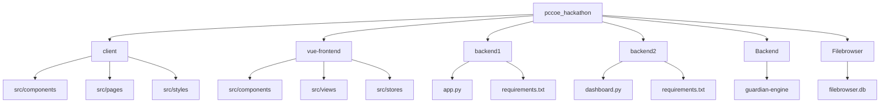
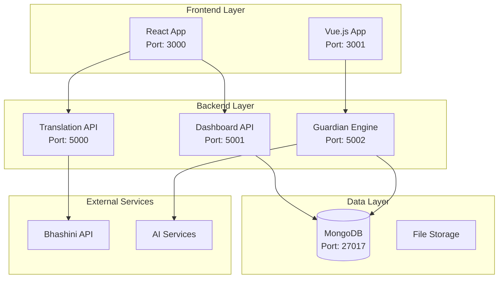
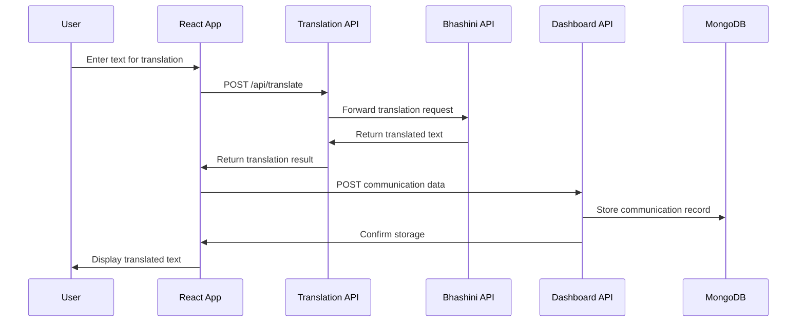
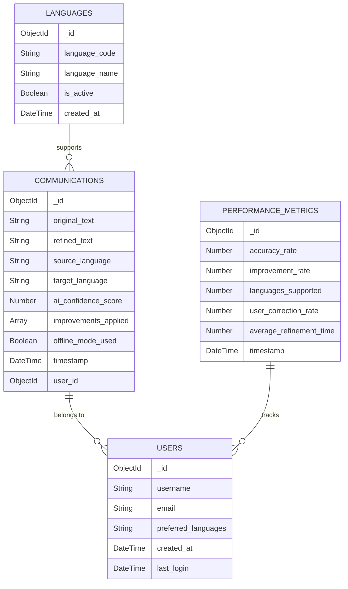
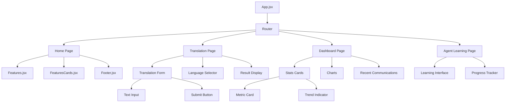
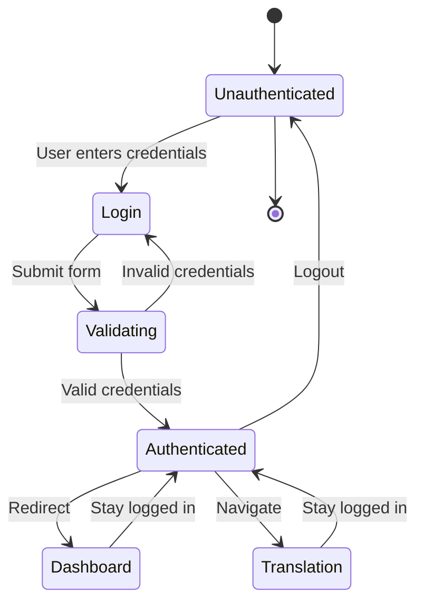

# PIISAFE - Privacy-Preserving AI Communication Platform

A fullstack web application that provides secure, privacy-preserving communication with AI assistance, featuring multi-language translation, offline capabilities, and comprehensive dashboard analytics.

## 🚀 Technology Stack

### Frontend
- **React 19** with Vite for fast development
- **Vue.js 3** with TypeScript for file management interface
- **Tailwind CSS** for styling
- **Framer Motion** for animations
- **React Router** for navigation
- **Axios** for API communication

### Backend
- **Flask** with Python 3.11+
- **Flask-CORS** for cross-origin requests
- **PyMongo** for MongoDB integration
- **python-dotenv** for environment management

### Infrastructure
- **Docker** for containerization
- **MongoDB** for data persistence
- **Nginx** for production serving

## 📁 Project Structure

```
pccoe_hackathon/
├── client/                 # React frontend (main app)
│   ├── src/
│   │   ├── components/    # React components
│   │   ├── pages/        # Page components
│   │   └── styles/       # CSS styles
│   ├── package.json
│   └── vite.config.js
├── vue-frontend/          # Vue.js file browser interface
│   ├── src/
│   │   ├── components/   # Vue components
│   │   ├── views/        # Vue pages
│   │   └── stores/       # Pinia stores
│   └── package.json
├── backend1/              # Translation API service
│   ├── app.py            # Flask translation API
│   └── requirements.txt
├── backend2/              # Dashboard & Analytics API
│   ├── dashboard.py      # Flask dashboard API
│   └── requirements.txt
├── Backend/              # Guardian Engine (PII detection)
│   └── guardian-engine/  # Privacy protection service
├── anushka/              # Integration & Analytics Microservices
│   ├── app.py           # Gmail Auth Service (Port: 3000)
│   ├── app2.py          # Task Management Service (Port: 3001)
│   ├── app3.py          # Learning Analytics Service (Port: 3002)
│   └── requirements.txt
├── Filebrowser/          # File management service
└── docker-compose.yml    # Multi-service orchestration
```

## 🛠️ Local Setup Instructions

### Prerequisites
- Node.js 18+ and npm
- Python 3.11+
- MongoDB (local or cloud)
- Docker and Docker Compose

### Frontend Setup (React)

```bash
# Navigate to React frontend
cd client

# Install dependencies
npm install

# Start development server
npm run dev

# Build for production
npm run build
```

### Frontend Setup (Vue.js)

```bash
# Navigate to Vue frontend
cd vue-frontend

# Install dependencies
npm install

# Start development server
npm run dev

# Build for production
npm run build
```

### Backend Setup

```bash
# Navigate to backend directory
cd backend1  # or backend2

# Create virtual environment
python -m venv venv
source venv/bin/activate  # On Windows: venv\Scripts\activate

# Install dependencies
pip install -r requirements.txt

# Set environment variables
cp .env.example .env
# Edit .env with your configuration

# Run Flask development server
python app.py  # or dashboard.py for backend2
```

### Docker Setup

```bash
# Build and start all services
docker-compose up --build

# Start in background
docker-compose up -d

# View logs
docker-compose logs -f

# Stop services
docker-compose down
```

## 🔧 Environment Variables

Create a `.env` file in each backend directory:

```bash
# .env.example
FLASK_ENV=development
FLASK_APP=app.py
FLASK_DEBUG=1

# API Configuration
REACT_APP_API_URL=http://localhost:5000
REACT_APP_VUE_API_URL=http://localhost:3000

# Database
MONGO_URI=mongodb://localhost:27017/
DATABASE_NAME=TCET2

# Translation API (backend1)
AUTHORIZATION_TOKEN=your_bhashini_token
DEFAULT_SERVICE_ID=ai4bharat/indictrans--gpu-t4

# Security
SECRET_KEY=your_secret_key_here
JWT_SECRET=your_jwt_secret_here

# External Services
BHASHINI_API_URL=https://dhruva-api.bhashini.gov.in
```

## 🐳 Docker Configuration

### Dockerfile for Flask Backend

```dockerfile
FROM python:3.11-slim

WORKDIR /app

# Install system dependencies
RUN apt-get update && apt-get install -y \
    gcc \
    && rm -rf /var/lib/apt/lists/*

# Copy requirements and install Python dependencies
COPY requirements.txt .
RUN pip install --no-cache-dir -r requirements.txt

# Copy application code
COPY . .

# Expose port
EXPOSE 5000

# Run the application
CMD ["python", "app.py"]
```

### Dockerfile for React Frontend

```dockerfile
FROM node:18-alpine AS builder

WORKDIR /app

# Copy package files
COPY package*.json ./

# Install dependencies
RUN npm ci --only=production

# Copy source code
COPY . .

# Build the application
RUN npm run build

# Production stage
FROM nginx:alpine

# Copy built files
COPY --from=builder /app/dist /usr/share/nginx/html

# Copy nginx configuration
COPY nginx.conf /etc/nginx/nginx.conf

# Expose port
EXPOSE 80

# Start nginx
CMD ["nginx", "-g", "daemon off;"]
```

## 📡 API Usage Examples

### Translation API (backend1)

```bash
# Translate text
curl -X POST http://localhost:5000/api/translate \
  -H "Content-Type: application/json" \
  -d '{
    "source_language": "en",
    "target_language": "hi",
    "text": "Hello, how are you?",
    "service_id": "ai4bharat/indictrans--gpu-t4"
  }'

# Response
{
  "translated_text": "नमस्ते, आप कैसे हैं?",
  "source_language": "en",
  "target_language": "hi",
  "confidence": 0.95
}
```

### Dashboard API (backend2)

```bash
# Get dashboard statistics
curl -X GET http://localhost:5001/api/dashboard/stats

# Get recent communications
curl -X GET "http://localhost:5001/api/dashboard/recent-communications?limit=5"

# Get language distribution
curl -X GET http://localhost:5001/api/dashboard/language-distribution

# Get user profile
curl -X GET http://localhost:5001/api/user/profile
```

### Communication History

```bash
# Get communication history
curl -X GET "http://localhost:5001/api/communications/history?page=1&limit=10"

# Apply suggestion
curl -X POST http://localhost:5001/api/dashboard/apply-suggestion \
  -H "Content-Type: application/json" \
  -d '{
    "communication_id": "507f1f77bcf86cd799439011",
    "suggestion": "improved_text_here"
  }'
```

## 🚀 Deployment

### DockerHub Deployment

```bash
# Build and tag images
docker build -t your-username/piisafe-backend:latest ./backend1
docker build -t your-username/piisafe-frontend:latest ./client

# Push to DockerHub
docker push your-username/piisafe-backend:latest
docker push your-username/piisafe-frontend:latest
```

### Render Deployment

1. Connect your GitHub repository
2. Set environment variables in Render dashboard
3. Configure build commands:
   - **Backend**: `pip install -r requirements.txt && python app.py`
   - **Frontend**: `npm install && npm run build`

### Heroku Deployment

```bash
# Create Heroku app
heroku create piisafe-app

# Add MongoDB addon
heroku addons:create mongolab:sandbox

# Deploy
git push heroku main

# Set environment variables
heroku config:set FLASK_ENV=production
heroku config:set MONGO_URI=your_mongo_uri
```

## 📊 Architecture Diagrams

### Folder Structure



### Service Architecture



### Request-Response Flow



### Database ER Diagram



### React Component Hierarchy



### Authentication Flow



## 🤝 Contributing

### Development Setup

1. Fork the repository
2. Create a feature branch: `git checkout -b feature/amazing-feature`
3. Make your changes and commit: `git commit -m 'Add amazing feature'`
4. Push to the branch: `git push origin feature/amazing-feature`
5. Open a Pull Request

### Code Style

- **Python**: Follow PEP 8 guidelines
- **JavaScript/React**: Use ESLint and Prettier
- **Vue.js**: Follow Vue.js style guide
- **CSS**: Use Tailwind CSS classes

### Testing

```bash
# Backend tests
cd backend1
python -m pytest

# Frontend tests
cd client
npm test

# Vue tests
cd vue-frontend
npm run test
```

## 📄 License

This project is licensed under the MIT License - see the [LICENSE](LICENSE) file for details.

## 🙏 Acknowledgments

- **Bhashini API** for translation services
- **Guardian Engine** for privacy protection
- **MongoDB** for data persistence
- **React** and **Vue.js** communities

## 📞 Support

For support and questions:
- Create an issue in the GitHub repository
- Contact the development team
- Check the documentation in `/docs` folder

---

**PIISAFE** - Making AI communication safe, secure, and accessible for everyone.